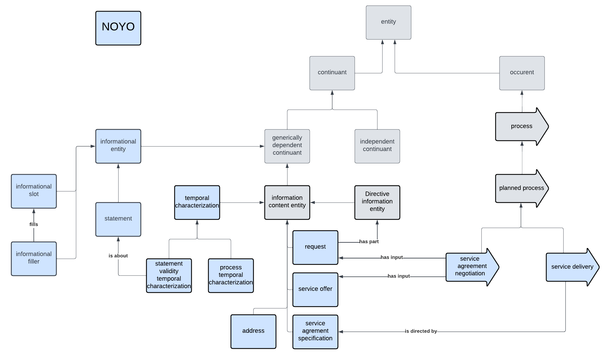

# NOYO Ontology Documentation

[//]: # "This file is meant to be edited by the ontology maintainer."

Welcome to the NOYO documentation!

You can find descriptions of the standard ontology engineering workflows [here](odk-workflows/index.md).

## NOYO schema

## Classes

|IRI                                           |value                                    |def                                                                                                                                                                                                                                              |
|----------------------------------------------|-----------------------------------------|-------------------------------------------------------------------------------------------------------------------------------------------------------------------------------------------------------------------------------------------------|
|NOYO_0000001                                  |request                                  |An information content entity representing the will of a person to have something done and specifications for the latter.                                                                                                                        |
|NOYO_0000010                                  |process temporal characterization        |A temporal specification that is about the occupation of a temporal interval by some processes.                                                                                                                                                  |
|NOYO_0000005                                  |service agreement negotiation            |A planned process of interaction between a request party and a service offer party having as specified input some request and some service offer and that aims to generate as output a service agreement.                                        |
|NOYO_0000003                                  |service agreement specification          |An information content entity that specifies a service agreement made between a request party and a service offer party. A service agreement specification can direct some processes that correspond to what has been agreed between the parties.|
|NOYO_0000012                                  |informational entity                     |A generically dependent continuant that is a building block of information or a combination thereof.                                                                                                                                             |
|NOYO_0000004                                  |address                                  |An information content entity that is about the location of some entity. (TBD)                                                                                                                                                                   |
|NOYO_0000002                                  |service offer                            |An information content entity describing the processes a person or an organization is willing to perform, usually for a compensation.                                                                                                            |
|NOYO_0000014                                  |informational slot                       |An informational entity that can be filled by an informational filler.                                                                                                                                                                           |
|NOYO_0000006                                  |service delivery                         |A planned process that aims at fulfilling the commitments of a service agreement.                                                                                                                                                                |
|NOYO_0000011                                  |statement validity temporal characterization|A temporal characterization specifying a temporal region during which a statement is considered valid.                                                                                                                                           |
|NOYO_0000009                                  |temporal characterization                |An information content entity that is about a one-dimension temporal region.                                                                                                                                                                     |
|NOYO_0000015                                  |informational filler                     |An informational entity that fills an informational slot.                                                                                                                                                                                        |
|NOYO_0000013                                  |statement                                |An informational entity that is considered valid by some agent at some point in time. (TBD)                                                                                                                                                      |

## Properties

|IRI                                           |value                                    |def|
|----------------------------------------------|-----------------------------------------|---|
|NOYO_0000016                                  |fills                                    |   |
|NOYO_0000008                                  |is directed by                           |   |
|NOYO_0000007                                  |directs                                  |   |
